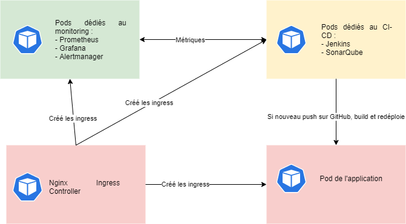
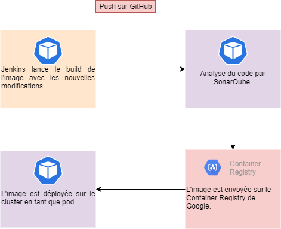

# Devops_Infra

## Fonctionnement




Les ressources sont déployées sur l'outil GKE, soit l'outil Google de Kubernetes. 



Lors d'un push sur le repository de l'application, Jenkins se lance automatiquement pour pull le repository et build l'image. Pendant cette procédure, SonarQube examine le code pour trouver des erreurs ou des points à améliorer. Ensuite, l'image est renommée et est envoyée sur le registre d'images de Google. Enfin, un nouveau pod est créé avec cette nouvelle image. 

## Deployment

### Nginx Ingress Controller

Nginx permet de transformer les IPs des services en noms de domaines. Cependant, pour les ingress créés de cette manière, on ne peut y accéder qu'en modifiant son /etc/hosts.
Pour installer Nginx, il suffit de lancer cette commande : 

```
kubectl apply -f https://raw.githubusercontent.com/kubernetes/ingress-nginx/controller-v0.45.0/deploy/static/provider/cloud/deploy.yaml
```

### Kube-Prometheus

Kube-Prometheus est un opérateur Prometheus qui déploie Alertmanager, Node-Exporter, Prometheus et Grafana. L'opérateur original est trouvable à cette adresse : https://github.com/prometheus-operator/kube-prometheus.
La première étape consiste à déployer le dossier Setup.

```
cd kube-prometheus
kubectl create -f kube-prometheus/setup
```

Puis, il nous faut créer un secret. Ce secret contient les informations nécessaires à Prometheus pour qu'il puisse monitorer d'autres ressources que celles par défaut (Ici Jenkins). 

```
kubectl create secret generic -n monitoring additional-scrape-configs --from-file=prometheus-additional.yaml
```
On peut ensuite déployer le reste de l'opérateur.

```
kubectl create -f kube-prometheus/
```

### SonarQube

SonarQube permet d'analyser du code et de trouver les erreurs et les points à améliorer.
SonarQube est déployé à l'aide de Helm. Le projet est disponible ici : https://github.com/Oteemo/charts/tree/master/charts/sonarqube.
On commence par installer Helm, s'il n'est pas déjà installé: 

```
$ curl -fsSL -o get_helm.sh https://raw.githubusercontent.com/helm/helm/master/scripts/get-helm-3
$ chmod 700 get_helm.sh
$ ./get_helm.sh
```
On ajoute ensuite le repo de Sonarqube, puis on l'installe.

```
helm repo add oteemocharts https://oteemo.github.io/charts
helm install -n ci-cd oteemocharts/sonarqube
```

### Jenkins

Jenkins est un outil d'automatisation, permettant le build automatique d'images ou de projets. 
Pour l'installer, on fait comme ceci :

```
cd jenkins/
kubectl create -f jenkins-deployment.yaml
```
